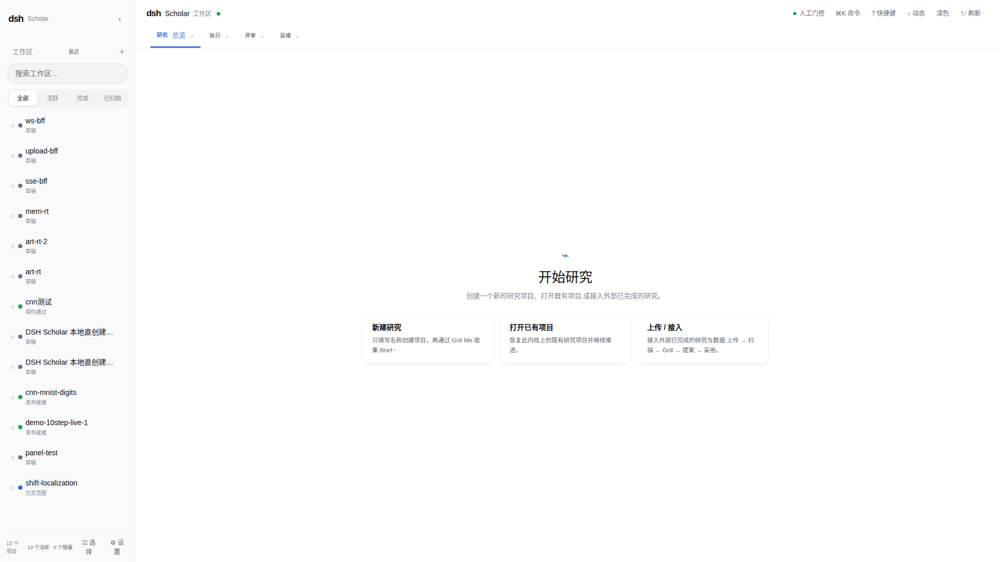
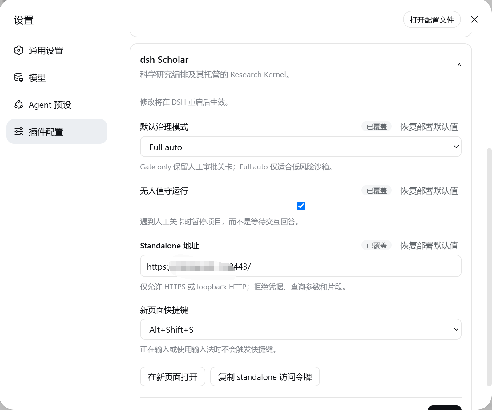
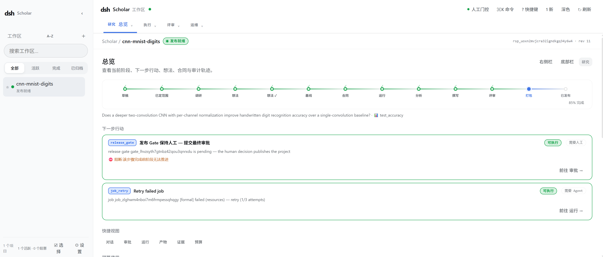
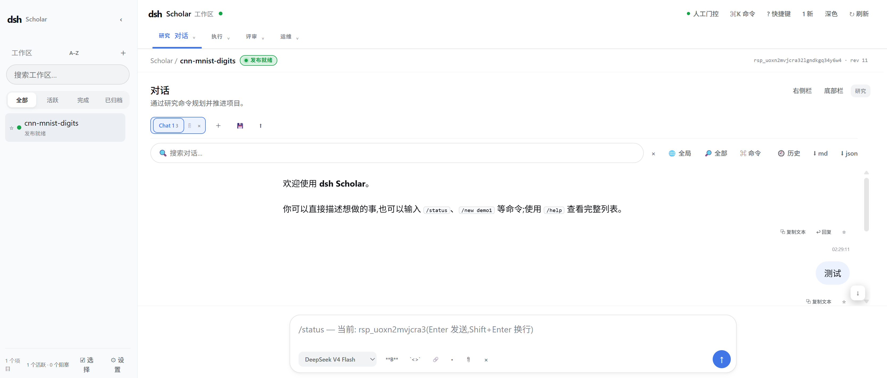
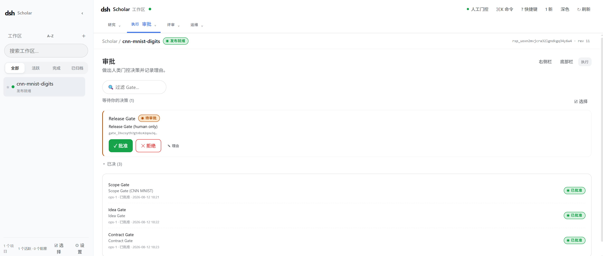
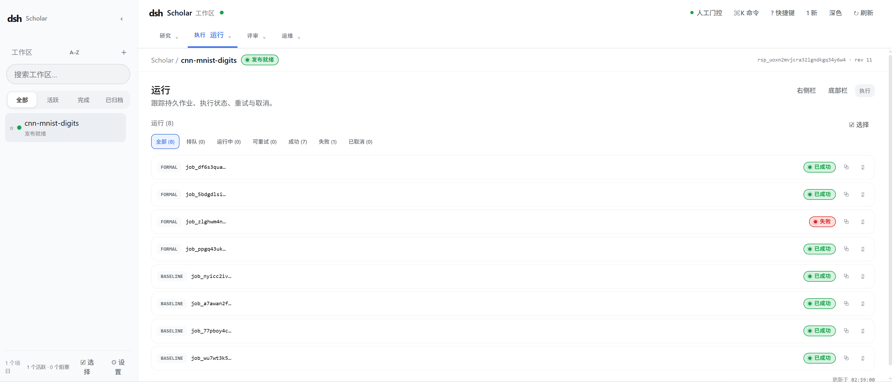
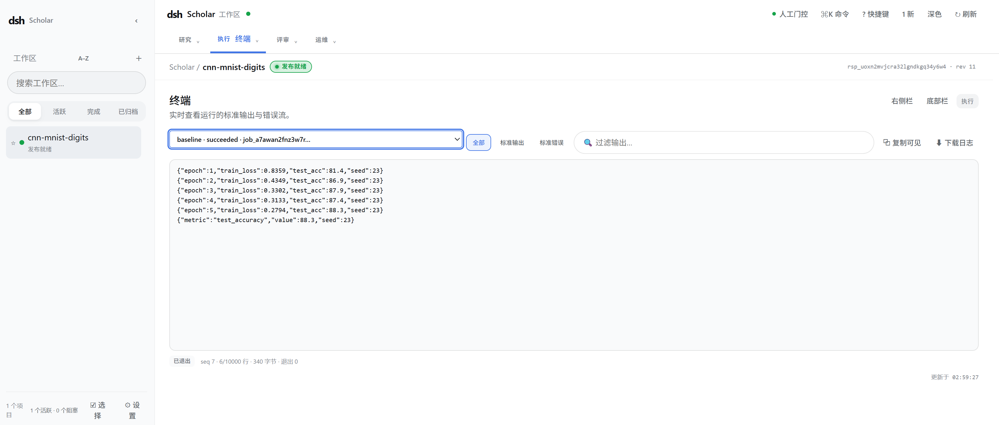
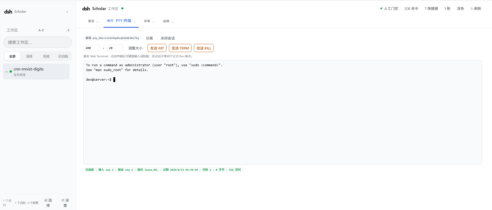
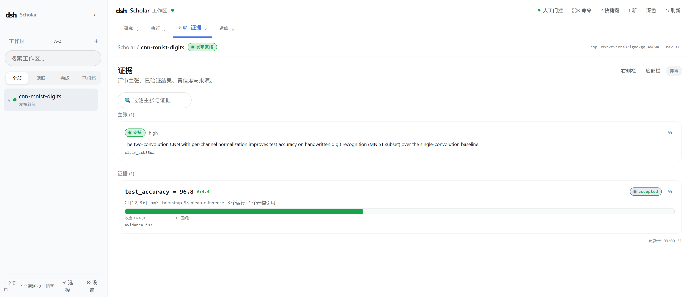
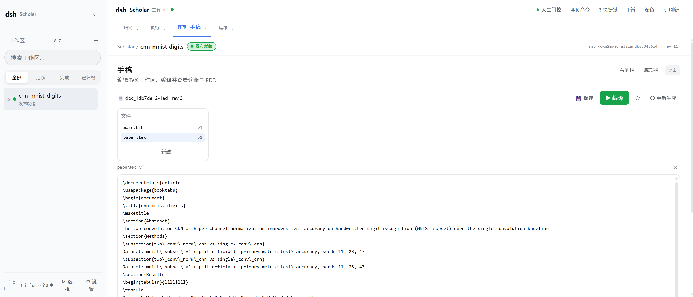

# DSH Scholar

**简体中文** | [English](README.en.md)

DSH Scholar 是面向纯计算研究的 AI 科研工作台。它把研究资料、项目对话、代码与数据、实验运行、证据账本和 TeX 手稿放在同一个可恢复项目中，既可以从新问题开始，也可以接入已经进行到一半的研究。



## 核心能力

- **可治理的研究流程**：从 Scope、Idea、Experiment Contract 到 Evidence、Claim 和 Release，关键节点由人类 Gate 把关。
- **受控实验**：Runner 在本机 Docker 或受控远端机器上执行冻结的实验计划，记录日志、状态与产物。
- **可追溯证据**：论文主张可追溯到受控 Run、Artifact 和经评审的 Evidence。
- **一体化工作台**：Chat、Workspace、Terminal、Manuscript、Trajectory 和 Settings 共用同一项目上下文。
- **可恢复与可审计**：Research Kernel 保存权威状态、NextAction、审批轨迹和产物引用。

## 使用边界

- DSH Scholar 辅助研究，不代替研究者承担科学判断、审批、署名和发布责任。
- 默认使用 `gate-only`；Agent 不能批准 Human Gate、伪造 accepted Evidence 或绕过实验合同。
- 正式实验必须绑定不可变代码/数据快照和固定执行环境，并由受控 Runner 真实执行。
- Chat、普通 stdout 和 Interactive Terminal 输出不会自动成为正式 Evidence。
- 产品聚焦机器学习、数据科学、生物信息学等纯计算研究，不适用于临床决策、人体试验、湿实验或其他高风险研究。

## 快速开始

完整的环境、端口、变量和验收矩阵见 [开发、测试与部署运行规范](docs/test-instance-plan.md)。本地体验需要：

- Linux；
- Node.js 24；
- pnpm 11.20.0；
- Docker Engine（正式实验、TeX 编译和 clean-room 复现必需）。

### 1. 安装与构建

```bash
pnpm install --frozen-lockfile
pnpm run build
```

### 2. 启动独立工作台

```bash
bash scripts/start-standalone-ui.sh
```

默认页面为 <http://127.0.0.1:18610>，Research Kernel 为 `127.0.0.1:17413`。首次打开时，粘贴以下 `0600` 文件中的访问令牌：

```text
~/.dsh-scholar-standalone/research-ui-standalone/standalone-token
```

`--no-token` 只用于 loopback、隔离且有人监督的开发环境。

### 3. 启动实验 Runner

没有 Runner 时仍可管理项目和文件，但实验 Job 会保持排队。需要在本机 Docker 中执行时，另开一个终端：

```bash
export DSH_SCHOLAR_KERNEL_TOKEN="$(< ~/.dsh-scholar-standalone/research-ui-standalone/kernel-token)"
export DSH_SCHOLAR_SERVICE_TOKEN="$(< ~/.dsh-scholar-standalone/research-ui-standalone/service-token)"
node workers/runner-gateway/lib/bin/runner.js \
  --kernel http://127.0.0.1:17413 \
  --mode docker
```

### 4. 将 Agent 插件接入 DSH

要获得完整的 DSH Scholar 集成体验，推荐使用 pnpm 安装并构建最新 DSH 源码，再从该源码仓库运行 DSH。先在 DSH 源码根目录执行：

```bash
pnpm install
pnpm run build
```

当前 `@dsh-scholar/*` 包尚未发布，因此随后仍需把本仓库的绝对路径作为本地插件加入 DSH 的 `web` profile：

```bash
cd /path/to/dsh-source
pnpm dsh plugin --profile web add /absolute/path/to/dsh-scholar
pnpm dsh plugin --profile web why @dsh-scholar/research-plugin
pnpm dsh web
```

这里的 `/path/to/dsh-source` 是最新 DSH 源码仓库，`/absolute/path/to/dsh-scholar` 是本仓库。这样会使用与最新 DSH 源码一致的插件 API、Web UI、Skills 和配置面。只运行 standalone 工作台不要求 DSH，但不会包含 Agent tools、slash commands、Skills、配置卡和 `dsh Scholar` 页签等完整集成能力。

更新 Scholar 时，先在本仓库重新执行 `pnpm run build`，然后回到 DSH 源码仓库再次执行 `pnpm dsh plugin --profile web add /absolute/path/to/dsh-scholar`。卸载命令为：

```bash
pnpm dsh plugin --profile web remove @dsh-scholar/research-plugin
```

插件向 DSH 提供 Scholar Agent 的 tools、slash commands、Skills、配置卡和 `dsh Scholar` 页签；页签复用已启动的 standalone 工作台。

## Plugin config

安装插件后，在 DSH 中打开 **设置 → 插件配置 → dsh Scholar**。保存的修改会在下一次重启 DSH 后生效。



| 配置项 | 默认值 | 说明 |
|---|---|---|
| 默认治理模式 | `gate-only` | 新建项目没有显式指定 mode 时使用。`gate-only` 保留人工关卡；`full-auto` 仅适合已配置 FixtureProfile 的低风险沙箱。 |
| 无人值守运行 | 关闭 | 不绕过人工 Gate；遇到 Gate 时暂停项目，而不是等待交互式回答。 |
| Standalone 地址 | `http://127.0.0.1:18610/` | 插件页签和“在新页面打开”的目标地址。仅允许 HTTPS 或 loopback HTTP。 |
| 新页面快捷键 | `Alt+Shift+S` | 可改为禁用；正在输入或使用输入法时不会触发。 |

Standalone 地址不允许凭据、查询参数或 URL 片段，令牌不应放入 URL。“复制 standalone 访问令牌”只在本机 loopback DSH 中、由用户显式点击后读取固定的 `0600` 令牌文件；页面不会显示令牌。它不会复制 Kernel、Runner、Provider 或 SSH 密钥。

更完整的配置与宿主约束见 [DSH 宿主集成规范](docs/dsh-integration.md)。

## 开始一个研究项目

进入工作台后可以从三种方式开始：

1. **Init**：填写项目名，在 Chat 中通过 Grill Me 补全研究 Brief，确认后创建 Scope Gate。
2. **Resume**：打开已有项目，恢复其阶段、会话、文件和任务。
3. **Upload**：上传论文、代码、数据或日志，从已有研究阶段接入。上传内容先进入隔离 Intake，不会自动成为 Evidence。

典型流程：

```text
创建/接入项目 → Grill Me → Scope Gate → 文献调研 → Idea Gate
→ Baseline → Experiment Contract → 实验运行 → Evidence 与 Claim
→ TeX 写作与评审 → 私有导出 → Release Gate
```

每个阶段的 Overview 和 Chat 都会读取 Kernel 的权威 `NextAction`，说明下一步、原因、执行者和阻断项。

## 工作台速览

| 区域 | 用途 |
|---|---|
| Chat | 进行项目对话、回答 Grill、上传文件并触发明确的研究操作。 |
| Workspace | 浏览、编辑、上传和管理项目文件，通过 version/etag 防止静默覆盖。 |
| Run / Terminal | 查看正式 Job 状态与只读日志，或使用项目绑定的 Interactive Terminal。 |
| Evidence / Artifacts | 评审主张、指标、置信度、来源和生成产物。 |
| Manuscript | 编辑 TeX、查看诊断与编译日志，并预览最新 PDF。 |
| Trajectory / Topology | 查看研究轨迹、subagent 父子关系、状态和产物。 |
| Settings | 配置 Model Provider、OCR、预算、Runner Profile 和执行环境。 |

Chat 支持普通文本和一级 slash command，常用命令包括：

```text
/new  /status  /survey  /ideas  /gates  /contract  /run
/evidence  /claims  /write  /review  /release-bundle  /release
```

完整的交互、命令和各阶段说明见 [使用指南](docs/USAGE_GUIDE.md)。

## 使用案例：CNN 手写数字识别

`cnn-mnist-digits` 项目演示了如何将模型改进想法推进为可审计结论。

| 项目 | 内容 |
|---|---|
| 研究问题 | 带逐通道归一化的双卷积 CNN，是否比单卷积 CNN 基线更准确？ |
| 数据与指标 | `mnist_subset_v1`；`test_accuracy` |
| 随机种子 | `11` / `23` / `47` |
| 结果 | `test_accuracy = 96.8%`；相比基线 `+4.4` 个百分点 |
| 不确定性 | bootstrap 95% 平均差置信区间 `[1.2, 8.6]`；`n=3` |

总览页把研究问题、当前阶段、完成度和下一步行动放在同一个视图中。



### 1. 通过 Chat 推进项目

每个研究项目拥有独立会话。研究者可以直接描述任务，也可以使用 `/status`、`/survey`、`/run` 等命令，并通过附件、拖拽或粘贴接入研究资料。



### 2. 审批研究设计

Scope、Idea 和 Contract Gate 依次锁定范围、方案与实验合同；Release Gate 仍由研究者决定。



### 3. 执行受控对照实验

基线与正式方案以独立 Job 执行。截图中的 8 次运行有 7 次成功、1 次失败；失败记录被保留并显式提示重试。



### 4. 查看运行数据与远程终端

Run Terminal 提供某个正式 Job 的只读 stdout/stderr、退出状态和可恢复日志。下图可查看 baseline 在各轮训练中的 `train_loss` 和 `test_acc`，以及随机种子 `23` 的最终 `test_accuracy = 88.3`。



Interactive Terminal 是绑定项目或 session 的真实 Web PTY，用于连接执行环境、输入命令、调整窗口和重连会话。它适合交互式检查和调试，但其输出不会自动成为正式 Evidence。



### 5. 聚合证据

系统将指标、效应量、置信区间、Run 和 Artifact 绑定到 Evidence。本案例的证据经评审后标记为 `accepted`，用于支持“双卷积方案优于基线”的主张。



### 6. 写作与发布

Manuscript 工作台用于编辑 `paper.tex` 和 `main.bib`，在固定 TeX Live 环境中编译手稿。评审与打包完成后，最终对外发布仍需批准 Release Gate。



## 开发与参考

常用校验命令：

```bash
pnpm run verify:docs
pnpm test
bash scripts/ci-gate.sh
```

- [使用指南](docs/USAGE_GUIDE.md)：完整交互流程与常见问题。
- [运行规范](docs/test-instance-plan.md)：环境、端口、环境变量、Runner 与测试命令。
- [DSH 宿主集成](docs/dsh-integration.md)：插件形状、配置、工具、命令和安装。
- [安全与科研完整性基线](docs/security-baseline.md)：Gate、Secret、Runner、Evidence 和 Web 安全。
- [验收与测试规范](docs/acceptance-tests.md)：功能、安全与回归场景。

## License

本项目采用 [BSD-3-Clause License](LICENSE)。
